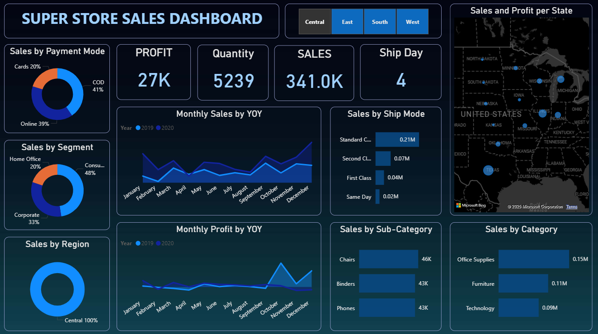

# 📊 Superstore Sales Dashboard – Power BI

This dashboard analyzes sales performance across regions, categories, and customer segments. It helps businesses quickly understand **profitability**, **top-performing products**, and **yearly trends**.

---

## 🔥 Key Highlights
- Interactive slicers for Region, Category, and Customer Segment  
- Visual insights into Sales, Profit, Quantity, and Discount patterns  
- Top 10 products and categories by sales performance  
- Month-wise profit and revenue trends  
- Region-wise breakdown for geographic insights  
- Clean and professional UI designed for business decision-making  

---

## 📝 Business Problem
Many small retailers and D2C brands struggle to answer simple questions like:
- Which products or categories generate the most revenue?
- Which channels (Instagram, Website, WhatsApp) are most profitable?
- Which months show growth or decline?

Without a clear dashboard, owners often make decisions by guesswork.

---

## 💡 What I Built
A **one-page Power BI dashboard** visualizing:
- Monthly sales (YOY) and monthly profit (YOY)
- Top products and top sub-categories by revenue
- Sales by channel and payment mode
- Shipping mode performance and geographic sales map
- KPI cards: Revenue, Profit, Units, Average Ship Day

Interactive filters allow owners to quickly drill into regions, categories, and timeframes.

---

## 📊 Key Insights
- Quickly identify top-performing categories and products  
- Track sales and profit trends across months and regions  
- Compare channel and payment method performance  
- Monitor shipping efficiency and geographic sales distribution  
- Gain actionable insights for inventory, marketing, and promotions  

---

## 📸 Dashboard Preview (Desktop View)

## 🎥 Dashboard Walkthrough (Video)
[Watch the demo video](Sales%20Dashboard%20-%20short%20demo.mp4)

---

## 🛠 Tools Used
- Power BI Desktop  
- DAX  
- Data Modeling  
- Data Cleaning in Power Query  

---

## 📁 Dataset
- Superstore dataset (public)

---

## 💰 Business Value
This dashboard helps owners:
- Identify top and underperforming categories quickly  
- Allocate marketing spend to the most profitable channels  
- Track seasonality and plan inventory & promotions effectively  

**Potential impact:** Informed decisions on top categories could increase weekly revenue and optimize resource allocation.

---

## 📦 Deliverables
- Power BI `.pbix` file (interactive)  
- Exported PDF of the report  
- Optional guidance on using the dashboard

---

## 💬 Interested?
If you’d like a free 10-minute sales audit (review 1 week or 1 month of CSV), reach out:  
📧 Email: sakshiys.sharma@gmail.com  
